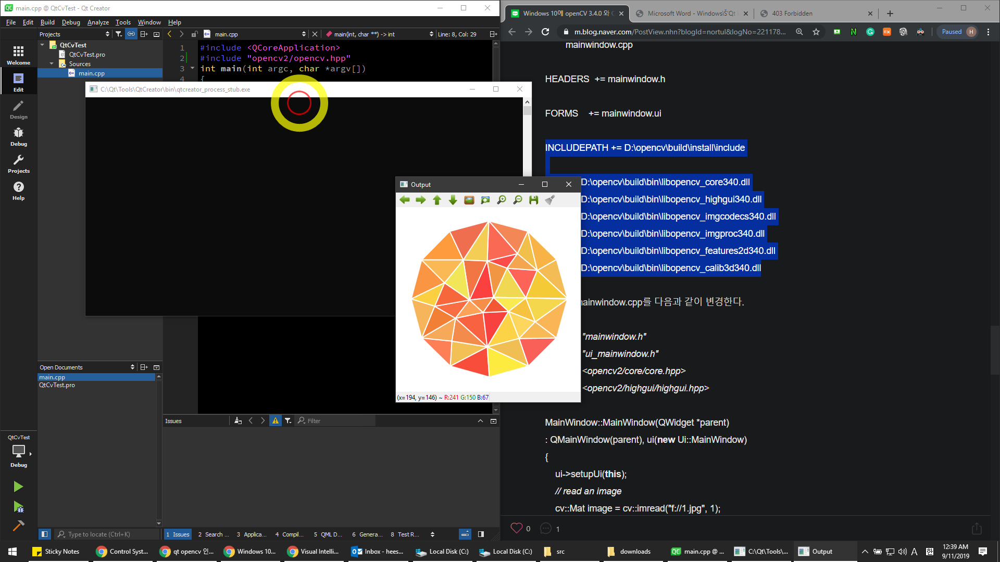

# qt_openCV
qt+openCV test

# Note

* Installation tutorial
    * [Qt installation](https://subscription.packtpub.com/book/application_development/9781788472395/1/ch01lvl1sec13/installing-qt)
    * [OpenCV installation](https://subscription.packtpub.com/book/application_development/9781788472395/1/ch01lvl1sec14/installing-opencv)
    * The versions of Qt and OpenCV are flexible as long as both of their compilers are identical.
    
* Development environment
    * OS: Window 10 64bit
    * Qt versiton: 5.13.1 [[Qt download]](https://www.qt.io/download-qt-installer?hsCtaTracking=99d9dd4f-5681-48d2-b096-470725510d34%7C074ddad0-fdef-4e53-8aa8-5e8a876d6ab4)
    * Qt compiler: Visual Studio 14 2015 64bit [[Visual Studio 14 2015 download]](https://go.microsoft.com/fwlink/?LinkId=532606&clcid=0x409)
    * OpenCV version: 3.4.6 [[OpenCV download]](https://opencv.org/releases/)
    * OpenCV build compiler: Visual Studio 14 2015 64bit [[Visual Studio 14 2015 download]](https://go.microsoft.com/fwlink/?LinkId=532606&clcid=0x409)

* Textbook
   * [Computer Vision with OpenCV3 and Qt5](https://subscription.packtpub.com/book/application_development/9781788472395)
   * Code files in textbook [[download]](https://account.packtpub.com/getfile/9781788472395/code)

* Qt + OpenCV test image

